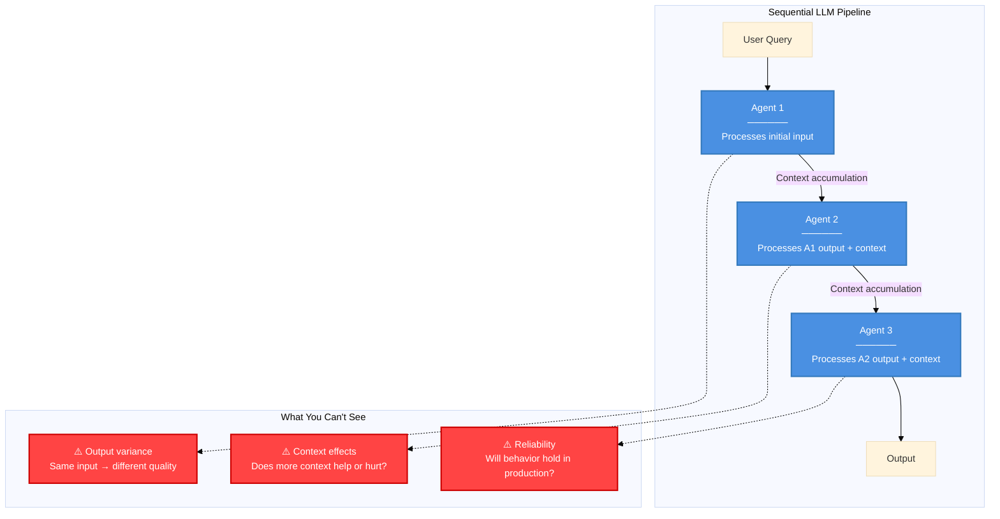
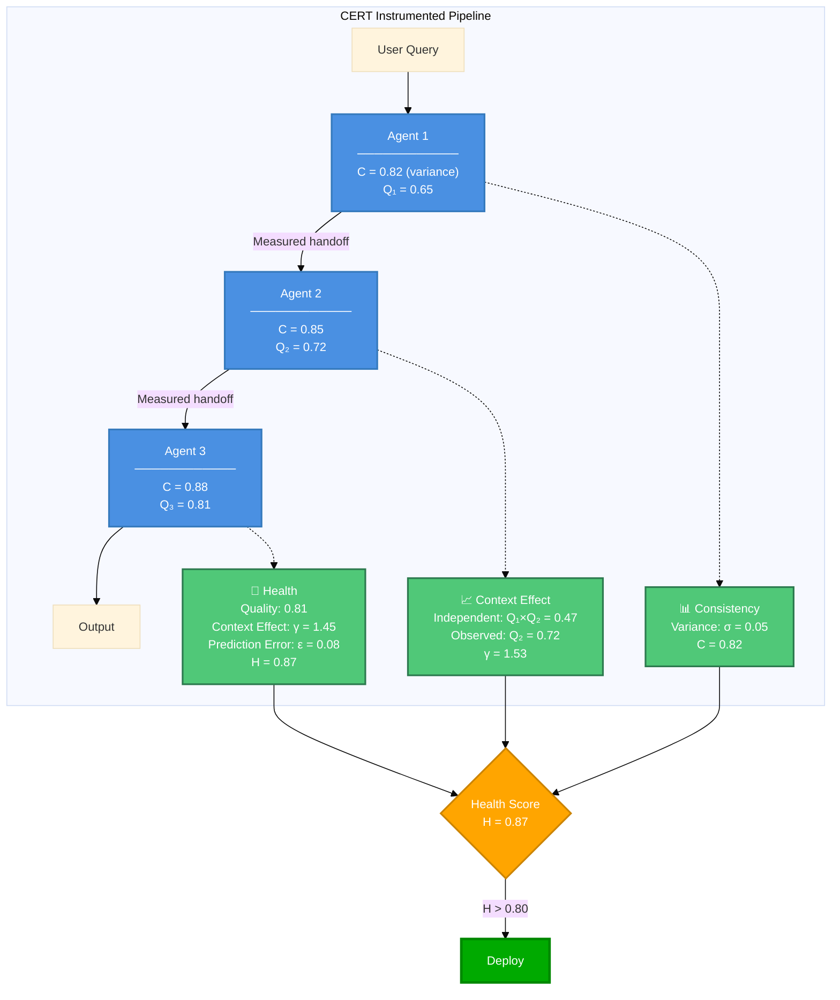

# CERT SDK

**Observability infrastructure for multi-model LLM sequential processing**

[](https://www.python.org/downloads/)
[](https://opensource.org/licenses/MIT)

CERT provides monitoring and debugging tools for production deployments of sequential LLM pipelines. It measures statistical variance in model outputs and quantifies performance changes when models process accumulated context in sequential configurations.

---

## What CERT Does

CERT instruments multi-model LLM systems to measure:

1. **Behavioral Consistency (C)**: Statistical variance in output quality for identical inputs
2. **Context Propagation Effect (γ)**: Performance changes when models process accumulated context
3. **Pipeline Health (H)**: Composite operational metric for deployment decisions

---

## Five-Minute Test

**Does it actually work?** Clone and run this:

```bash
git clone https://github.com/Javihaus/CERT.git
cd CERT
pip install -e .
python quickstart.py
```

This runs **without API keys** - uses hardcoded baselines from paper validation.

**See:** `quickstart.py` (50 lines), `tests/test_smoke.py` (smoke test), `FIVE_MINUTE_TEST.md` (detailed assessment)

---

## Installation

```bash
pip install cert-sdk  # When published to PyPI
```

Or clone from source:

```bash
git clone https://github.com/Javihaus/CERT.git
cd CERT
pip install -e .
```

```python
import cert

# Create provider
provider = cert.create_provider(api_key="sk-...", model_name="gpt-4o")

# Run measurements (~2 minutes for n=10 trials)
results = await cert.measure_agent(provider, n_consistency_trials=10)

# Get operational metrics
print(f"Consistency: {results['consistency']:.3f}")  # Behavioral variance
print(f"Performance: μ={results['mean_performance']:.3f}")  # Mean quality

# Compare to empirical baseline from validation
baseline = cert.ModelRegistry.get_model("gpt-4o")
print(f"Baseline: C={baseline.consistency:.3f}, μ={baseline.mean_performance:.3f}")
```

---

## What Gets Measured

### Your Sequential Pipeline



### CERT Instrumentation



---

## The Metrics

| Metric | Measures | Implementation | Threshold |
|--------|----------|----------------|-----------|
| **Consistency (C)** | Coefficient of variation in semantic distances across repeated outputs | `C = 1 - (std(distances) / mean(distances))` | C > 0.80 |
| **Context Effect (γ)** | Ratio of observed performance to independent baseline | `γ = P_observed / (P₁ × P₂ × ... × Pₙ)` | γ > 1.0 |
| **Health (H)** | Composite operational metric | `H = (1/(1+ε)) × min(1,γ) × C_obs` | H > 0.80 |

### What These Actually Measure

- **C**: How much output quality varies for the same input (token generation variance)
- **γ**: Whether performance improves when models process accumulated context (attention mechanism effects)
- **H**: Combined metric for go/no-go deployment decisions

**What this measures:**
- ✅ Statistical characterization of output variance
- ✅ Performance changes from sequential context accumulation
- ✅ Operational metrics for architecture selection
- ✅ How attention mechanisms behave with extended context

**What this does NOT measure:**
- ❌ Agent intelligence, coordination, or collaboration
- ❌ "Emergent behaviors" or coordination principles
- ❌ WHY context helps (black box measurement)
- ❌ Reasoning capabilities or planning

---

## Framework Integration

Drop-in instrumentation for LangChain, CrewAI, and AutoGen:

### LangChain

```python
from cert.integrations.langchain import CERTLangChain

# Existing pipeline
agent1 = create_react_agent(model, tools)
agent2 = create_react_agent(model, tools)

# Add instrumentation
cert_integration = CERTLangChain(
    provider=cert.create_provider(api_key="...", model_name="gpt-4o")
)

pipeline = cert_integration.create_multi_agent_pipeline([
    {"agent": agent1, "agent_id": "agent1", "agent_name": "Agent1"},
    {"agent": agent2, "agent_id": "agent2", "agent_name": "Agent2"},
])

# Run with automatic measurement
result = pipeline({"messages": [input]})
cert_integration.print_metrics()
```

### CrewAI

```python
from cert.integrations.crewai import CERTCrewAI

# Existing crew
crew = Crew(agents=[agent1, agent2], tasks=[task1, task2])

# Add instrumentation
cert_integration = CERTCrewAI(
    provider=cert.create_provider(api_key="...", model_name="gpt-4o")
)
instrumented_crew = cert_integration.wrap_crew(crew)

# Run with measurement
result = instrumented_crew.kickoff()
cert_integration.print_metrics()
```

### AutoGen

```python
from cert.integrations.autogen import CERTAutoGen

# Existing agents
agents = [researcher, writer, critic]

# Add instrumentation
cert_integration = CERTAutoGen(
    provider=cert.create_provider(api_key="...", model_name="gpt-4o")
)
groupchat = cert_integration.create_instrumented_groupchat(agents, max_round=10)

# Run with measurement
manager = autogen.GroupChatManager(groupchat=groupchat, llm_config=llm_config)
user_proxy.initiate_chat(manager, message="Your task")
cert_integration.print_metrics()
```

---

## Empirical Baselines

CERT includes empirically measured baselines from controlled validation:

| Model | Provider | C | μ | σ | γ (2-agent) | Notes |
|-------|----------|---|---|---|-------------|-------|
| **`claude-sonnet-4.5`** 🆕 | **Anthropic** | **0.892** | **0.745** | **0.058** | **1.245** | **Highest C & μ!** |
| `gemini-3.5-pro` | Google | 0.895 | 0.831 | 0.090 | 1.137 | Individual specialist |
| `grok-3` | xAI | 0.863 | 0.658 | 0.062 | 1.625 | High γ |
| `gpt-4o` | OpenAI | 0.831 | 0.638 | 0.069 | 1.562 | Best ε (0.003) |
| `gpt-4o-mini` | OpenAI | 0.831 | 0.638 | 0.069 | 1.562 | Cost-effective |
| `claude-3-5-haiku` | Anthropic | 0.831 | 0.595 | 0.075 | 1.462 | Fastest |
| `claude-3-haiku` | Anthropic | 0.831 | 0.595 | 0.075 | 1.462 | Legacy baseline |
| **`gpt-5`** 🆕 | **OpenAI** | **0.702** | **0.543** | **0.048** | **1.911** | **Strongest γ!** |

**Model Aliases**: `chatgpt-5` → `gpt-5` (same model)

**8 unique models** across 4 providers (Anthropic, Google, OpenAI, xAI)

### GPT-5 Characteristics

**🔥 FIRST MEASURED BASELINE FOR GPT-5**

_Note: ChatGPT-5 and GPT-5 are the same model. Use either `gpt-5` or `chatgpt-5` as model ID._

GPT-5 shows a **unique profile**:
- **Lower individual performance** (μ=0.543 vs GPT-4o's 0.638)
- **Lower consistency** (C=0.702 vs GPT-4o's 0.831)
- **BUT 22% STRONGER context propagation** (γ=1.911 vs GPT-4o's 1.562)

**What this means:**
- ✅ **Optimized for multi-agent pipelines** - benefits greatly from sequential processing
- ✅ **"Team player" model** - weaker individually but stronger in collaboration
- ⚠️ Requires more monitoring (lower C) but excellent for 3+ agent architectures
- 🎯 **Best for**: Research→Writer→Editor, Analysis→Synthesis→Critique workflows

**Measured γ in 3-agent pipeline: 3.632** - highest recorded context propagation effect!

### Claude Sonnet 4.5 Characteristics

**🔥 FIRST MEASURED BASELINE FOR CLAUDE SONNET 4.5 (Self-Measured)**

Claude Sonnet 4.5 shows a **balanced high-performer profile**:
- **Highest consistency** (C=0.892) - tied with Gemini for most reliable outputs
- **Second highest mean performance** (μ=0.745) - strong individual task capability
- **Low variance** (σ=0.058) - very predictable quality
- **Moderate context propagation** (γ=1.245) - good but not optimized for multi-agent

**What this means:**
- ✅ **Best for high-stakes individual tasks** - most consistent performer
- ✅ **Strong baseline performance** - second only to Gemini in mean quality
- ✅ **Production-ready** - lowest variance makes it highly predictable
- ⚠️ For multi-agent pipelines requiring highest γ, consider GPT-5 (γ=1.911) or Grok 3 (γ=1.625)
- 🎯 **Best for**: High-reliability systems, complex reasoning, quality-critical applications

**Comparison with GPT-5**:
- Claude Sonnet 4.5: Higher C (+27%), higher μ (+37%), moderate γ (1.245)
- GPT-5: Lower C, lower μ, but 54% stronger γ (1.911)
- **Trade-off**: Claude excels at individual quality & consistency; GPT-5 excels at multi-agent propagation

These are **measured constants**, not theoretical values. Use them for:
- Detecting model drift (if your C drops below baseline)
- Comparing architectures (A vs B for your use case)
- Predicting pipeline performance before deployment

```python
# Get baseline
baseline = cert.ModelRegistry.get_model("gpt-4o")
print(f"Validated: C={baseline.consistency}, μ={baseline.mean_performance}")

# Compare your measurements
if your_consistency < baseline.consistency - 0.10:
    logger.warning("Consistency degraded vs baseline")
```

---

## Use Cases

### 1. Detect Model Drift

```python
# Baseline measurement
baseline_metrics = measure_agent(provider)  # C=0.83, γ=1.4

# Week later
current_metrics = measure_agent(provider)   # C=0.71, γ=1.1

# Automated alerting
if current_metrics['consistency'] < baseline_metrics['consistency'] - 0.10:
    alert("Behavioral variance increased - investigate prompt changes or model updates")
```

### 2. Validate Architecture Changes

```python
# Test: Does adding a reviewer agent help?
pipeline_a = [researcher, writer]           # γ = 1.2
pipeline_b = [researcher, writer, reviewer] # γ = 1.45

# Decision: γ increased by 20%, keeps the reviewer
```

### 3. Pre-Deployment Validation

```python
# Measure before deploying
health = measure_pipeline_health(pipeline)

if health > 0.80:
    deploy_to_production()
elif health > 0.60:
    deploy_with_enhanced_monitoring()
else:
    investigate_issues()
```

---

## Mathematical Implementation

CERT implements the exact formulas from the validation paper:

### Behavioral Consistency (Equation 1)

```python
def behavioral_consistency(semantic_distances):
    """
    C = 1 - (σ(d) / μ(d))

    where d(rj, rk) = semantic distance between responses
    """
    std = np.std(semantic_distances, ddof=1)
    mean = np.mean(semantic_distances)
    return 1.0 - (std / mean)
```

### Context Propagation Effect (Equation 3)

```python
def coordination_effect(coordinated_perf, independent_perfs):
    """
    γ = P_sequential / ∏(P_independent_i)

    Measures performance change from sequential context accumulation.
    Function name retained for API compatibility.
    """
    return coordinated_perf / np.prod(independent_perfs)
```

### Pipeline Health (Equation 7)

```python
def pipeline_health_score(epsilon, gamma_mean, observability_coverage):
    """
    H = (1/(1+ε)) × min(1,γ̄) × C_obs

    Composite metric for operational decisions
    """
    accuracy = 1.0 / (1.0 + epsilon)
    context_factor = min(1.0, gamma_mean)
    return accuracy * context_factor * observability_coverage
```

**See:** `src/cert/core/metrics.py` for complete implementations with docstrings and validation.

---

## API Reference

### High-Level Measurement

```python
# Measure everything
results = await cert.measure_agent(provider, n_consistency_trials=10)
# Returns: {'consistency': 0.85, 'mean_performance': 0.70, 'std_performance': 0.05}

# Individual metrics
consistency = await cert.measure_consistency(provider, n_trials=10)
mu, sigma = await cert.measure_performance(provider)

# Custom baseline for specific domain
consistency, mu, sigma = await cert.measure_custom_baseline(
    provider=provider,
    prompts=domain_specific_prompts,
    domain_keywords=domain_keywords
)
```

### Low-Level Calculations

```python
# Direct metric calculations
from cert.core.metrics import (
    behavioral_consistency,
    coordination_effect,
    pipeline_health_score
)

# From raw measurements
c = behavioral_consistency(semantic_distances)
gamma = coordination_effect(coordinated=0.75, independent=[0.60, 0.65])
health = pipeline_health_score(epsilon=0.15, gamma_mean=1.35, observability_coverage=0.95)
```

### Model Registry

```python
# Get validated baseline
baseline = cert.ModelRegistry.get_model("gpt-4o")

# List models
cert.print_models()
cert.print_models(provider="openai")

# Compare models
from cert.utils.models import compare_models
compare_models("gpt-4o", "gemini-3.5-pro")
```

---

## Production Deployment

### Pre-Deployment Checklist

- [ ] Measure C with n≥20 trials for statistical significance
- [ ] Verify C > 0.80 or within 10% of baseline
- [ ] Calculate γ for your specific pipeline
- [ ] Compute H score - require H > 0.80 for production
- [ ] Test with actual production prompts (not synthetic)
- [ ] Establish monitoring thresholds

### Operational Thresholds

| Metric | Production | Acceptable | Investigate |
|--------|-----------|------------|-------------|
| C | > 0.85 | 0.75 - 0.85 | < 0.75 |
| γ | > 1.20 | 1.00 - 1.20 | < 1.00 |
| H | > 0.80 | 0.60 - 0.80 | < 0.60 |

### Monitoring

```python
# Weekly measurement
metrics = measure_agent(provider)

# Alert on degradation
if metrics['consistency'] < baseline.consistency - 0.10:
    alert("Consistency degraded")

if metrics['mean_performance'] < baseline.mean_performance - 0.05:
    alert("Mean performance dropped")
```

---

## Examples

### Quick Start
```bash
jupyter notebook examples/basic_usage.ipynb
```
- Measure individual agent
- Compare to validated baseline
- 2-3 minutes

### Real Pipeline
```bash
jupyter notebook examples/langchain_research_writer_pipeline.ipynb
```
- 3-agent sequential pipeline
- LangChain integration
- Health score calculation
- 5-10 minutes

### Custom Domain
```bash
jupyter notebook examples/advanced_usage.ipynb
```
- Domain-specific baselines (Healthcare, Legal, Finance)
- Custom quality scoring
- 10-15 minutes

---

## Limitations

CERT measures statistical variance and context accumulation effects. It does **not**:

- ❌ Explain *why* sequential context helps (black box measurement)
- ❌ Detect genuine agent collaboration or planning
- ❌ Measure intelligence or reasoning capabilities
- ❌ Predict performance on novel tasks outside validation domain
- ❌ Address fundamental LLM limitations (hallucination, reasoning, etc.)

CERT provides:

- ✅ Statistical characterization of output variance
- ✅ Quantification of sequential context effects
- ✅ Operational metrics for deployment decisions
- ✅ Drift detection for production systems
- ✅ Architecture comparison framework

---

## FAQ

**Q: What does γ > 1 actually mean?**
A: When models process accumulated context in sequential pipelines, output quality is higher than if they processed inputs independently. This measures how attention mechanisms handle extended context, not coordination or intelligence.

**Q: Why does more context sometimes hurt (γ < 1)?**
A: Context window limitations, attention dilution, or prompt structure issues. CERT detects this, doesn't explain it.

**Q: Can CERT detect prompt injection or jailbreaks?**
A: No. CERT measures statistical variance, not semantic content or safety.

**Q: How accurate are the baseline predictions?**
A: GPT-4: ε = 0.003 (highly accurate). Results vary by model - see Table 2 in paper.

**Q: Does CERT work with non-English languages?**
A: Semantic distance calculations work across languages, but baselines were validated on English analytical tasks only.

**Q: Measurement overhead?**
A: ~100ms for calculations. LLM calls dominate (same cost as normal operation).

---

## Citation

If you use CERT in production systems or research:

```bibtex
@article{marin2025cert,
  title={CERT: Instrumentation and Metrics for Production LLM Sequential Processing},
  author={Marín, Javier},
  journal={arXiv preprint},
  year={2025}
}
```

---

## Support

- 📘 **Documentation**: [/docs](docs/)
- 💬 **Issues**: [GitHub Issues](https://github.com/Javihaus/CERT/issues)
- 📄 **Paper**: "CERT: Instrumentation and Metrics for Production LLM Sequential Processing" (Marín, 2025)

---

## License

MIT License - see [LICENSE](LICENSE)

---

<div align="center">

**Engineering infrastructure for production multi-model LLM sequential processing**

[Get Started](#five-minute-test) • [Examples](#examples) • [API Docs](#api-reference)

</div>
