# CERT SDK

**Will your multi-agent system work in production? Find out in 2 minutes.**

[](https://www.python.org/downloads/)
[](https://opensource.org/licenses/MIT)

---

## 30-Second Demo

```python
pip install cert-sdk
```

```python
import cert

# 1. Pick your model
provider = cert.create_provider(api_key="sk-...", model_name="gpt-4o")

# 2. Run measurements (takes ~2 min)
results = await cert.measure_agent(provider)

# 3. Get your answer
# ✓ Consistency: 0.831 (predictable)
# ✓ Performance: μ=0.638 (validated baseline)
# ✓ Ready for production
```

**That's it.** No complex setup. No configuration files. Just answers.

---

## Why You Need This

### Your Multi-Agent System Today

```mermaid
%%{init: {'theme':'base', 'themeVariables': { 'fontSize':'14px', 'fontFamily':'arial'}}}%%
graph TB
    subgraph "Your Production Pipeline"
        U[User Query:<br/>'Analyze Q3 sales strategy'] --> A1

        A1[Agent 1: Researcher<br/>─────────────<br/>Gathers data & insights]
        A2[Agent 2: Analyzer<br/>─────────────<br/>Processes information]
        A3[Agent 3: Writer<br/>─────────────<br/>Creates final report]

        A1 -->|Context + Data| A2
        A2 -->|Analysis + Findings| A3
        A3 --> OUT[Final Output<br/>to User]
    end

    subgraph "Problems You Can't See"
        P1["❌ Inconsistent Behavior<br/>Same input → different quality"]
        P2["❌ Poor Coordination<br/>Agents don't improve each other"]
        P3["❌ Unpredictable Quality<br/>Works in dev, fails in prod"]
    end

    A1 -.->|"⚠️ Is response<br/>consistent?"| P1
    A2 -.->|"⚠️ Does analysis<br/>improve output?"| P2
    A3 -.->|"⚠️ Will quality<br/>hold in prod?"| P3

    style P1 fill:#ff4444,stroke:#cc0000,stroke-width:2px,color:#fff
    style P2 fill:#ff4444,stroke:#cc0000,stroke-width:2px,color:#fff
    style P3 fill:#ff4444,stroke:#cc0000,stroke-width:2px,color:#fff
    style A1 fill:#4a90e2,stroke:#357abd,stroke-width:2px,color:#fff
    style A2 fill:#4a90e2,stroke:#357abd,stroke-width:2px,color:#fff
    style A3 fill:#4a90e2,stroke:#357abd,stroke-width:2px,color:#fff
```



### What CERT Measures (At Each Step)

```mermaid
%%{init: {'theme':'base', 'themeVariables': { 'fontSize':'14px', 'fontFamily':'arial'}}}%%
graph TB
    subgraph "CERT Instrumented Pipeline"
        U2[User Query] --> A1B

        A1B["Agent 1: Researcher<br/>──────────────────<br/>✓ Consistency: C = 0.82<br/>✓ Quality: Q₁ = 0.65"]
        A2B["Agent 2: Analyzer<br/>──────────────────<br/>✓ Consistency: C = 0.85<br/>✓ Quality: Q₂ = 0.72"]
        A3B["Agent 3: Writer<br/>──────────────────<br/>✓ Consistency: C = 0.88<br/>✓ Quality: Q₃ = 0.81"]

        A1B -->|"Measured handoff"| A2B
        A2B -->|"Measured handoff"| A3B
        A3B --> OUT2[Final Output]

        A1B -.-> M1["📊 Consistency Check<br/>Same query 10x:<br/>Quality variance = 0.05<br/>Status: ✓ Predictable"]

        A2B -.-> M2["🔄 Coordination Check<br/>Expected: Q₁ × Q₂ = 0.47<br/>Actual: Q₂ = 0.72<br/>γ = 1.53 (53% boost)<br/>Status: ✓ Strong synergy"]

        A3B -.-> M3["💚 Health Check<br/>Pipeline Quality: 0.81<br/>Coordination: γ = 1.45<br/>Prediction Error: 0.08<br/>H = 0.87<br/>Status: ✓ Production Ready"]
    end

    M1 --> DECISION
    M2 --> DECISION
    M3 --> DECISION

    DECISION{Health Score<br/>H = 0.87}
    DECISION -->|H > 0.80| DEPLOY[✓ Deploy to Production<br/>with confidence]

    style M1 fill:#50C878,stroke:#2d7a4f,stroke-width:2px,color:#fff
    style M2 fill:#50C878,stroke:#2d7a4f,stroke-width:2px,color:#fff
    style M3 fill:#50C878,stroke:#2d7a4f,stroke-width:2px,color:#fff
    style A1B fill:#4a90e2,stroke:#357abd,stroke-width:2px,color:#fff
    style A2B fill:#4a90e2,stroke:#357abd,stroke-width:2px,color:#fff
    style A3B fill:#4a90e2,stroke:#357abd,stroke-width:2px,color:#fff
    style DEPLOY fill:#00aa00,stroke:#008800,stroke-width:3px,color:#fff
    style DECISION fill:#ffa500,stroke:#cc8400,stroke-width:2px,color:#fff
```



### The Metrics

| Metric | What It Measures | Why It Matters | Threshold |
|--------|------------------|----------------|-----------|
| **Consistency (C)** | Does the agent produce similar quality output for the same input? | Prevents unpredictable behavior in production | **C > 0.80** |
| **Coordination (γ)** | Do agents improve each other's work, or just add latency? | Validates if your multi-agent architecture adds value | **γ > 1.0** |
| **Health (H)** | Is the entire pipeline production-ready? | Single go/no-go metric for deployment | **H > 0.80** |

**Traditional monitoring gives you:** Latency ✓, Token count ✓, Errors ✓
**But can't answer:** Will it behave the same way tomorrow? Do my agents actually help each other?

**CERT gives you:** Quantitative answers to deploy with confidence.

---

## Framework Integration (Drop-in for Your Stack)

Works with **LangChain**, **CrewAI**, and **AutoGen** - zero refactoring:

### LangChain Example

```python
from cert.integrations.langchain import CERTLangChain

# Your existing code
researcher = create_react_agent(model, tools)
writer = create_react_agent(model, tools)

# Add CERT (3 lines)
cert_integration = CERTLangChain(provider=cert_provider)
pipeline = cert_integration.create_multi_agent_pipeline([
    {"agent": researcher, "agent_id": "researcher", "agent_name": "Researcher"},
    {"agent": writer, "agent_id": "writer", "agent_name": "Writer"},
])

# Run and get metrics automatically
result = pipeline({"messages": [input]})
cert_integration.print_metrics()
# ✓ Coordination Effect: γ = 1.52 (52% improvement)
# ✓ Health Score: 0.89 (production ready)
```

### CrewAI Example

```python
from cert.integrations.crewai import CERTCrewAI

# Your existing code
crew = Crew(agents=[researcher, writer], tasks=[task1, task2])

# Add CERT (2 lines)
cert_integration = CERTCrewAI(provider=cert_provider)
instrumented_crew = cert_integration.wrap_crew(crew)

# Metrics collected automatically
result = instrumented_crew.kickoff()
cert_integration.print_metrics()
```

### AutoGen Example

```python
from cert.integrations.autogen import CERTAutoGen

# Your existing code
agents = [researcher, writer, critic]

# Add CERT (2 lines)
cert_integration = CERTAutoGen(provider=cert_provider)
groupchat = cert_integration.create_instrumented_groupchat(agents, max_round=10)

# Track full conversation
manager = autogen.GroupChatManager(groupchat=groupchat, llm_config=llm_config)
user_proxy.initiate_chat(manager, message="Your task")
cert_integration.print_metrics()
```

**See it in action:** [Real LangChain Pipeline Example](examples/langchain_research_writer_pipeline.ipynb)

---

## What Gets Measured

```mermaid
graph TD
    A[User Input] --> B[Agent 1: Researcher]
    B --> C[Agent 2: Writer]
    C --> D[Agent 3: Editor]
    D --> E[Final Output]

    B -.-> F[Quality: 0.65]
    C -.-> G[Quality: 0.72]
    D -.-> H[Quality: 0.81]

    F --> I[Coordination Effect<br/>γ = 1.45<br/>45% improvement]
    G --> I
    H --> I

    I --> J{Health Score<br/>H = 0.87}
    J -->|H > 0.8| K[✓ Production Ready]
    J -->|0.6 < H < 0.8| L[⚠ Deploy with monitoring]
    J -->|H < 0.6| M[❌ Investigate first]
```



### 1. Consistency (C) - "Will it do this again?"

| Score | Meaning | Action |
|-------|---------|--------|
| **C > 0.85** | ✓ Highly consistent | Ship it |
| **0.7 - 0.85** | ⚠ Acceptable | Monitor closely |
| **C < 0.7** | ❌ Unpredictable | Fix prompts or change model |

### 2. Coordination (γ) - "Do agents help or hurt each other?"

| Score | Meaning | Decision |
|-------|---------|----------|
| **γ > 1.2** | ✓ Strong synergy | Keep all agents |
| **γ = 1.0** | = No coordination | Consider simplifying |
| **γ < 0.9** | ❌ Agents interfere | Remove agents or reorder |

### 3. Health (H) - "Production ready?"

| Score | Status | Action |
|-------|--------|--------|
| **H > 0.8** | ✓ Production ready | Deploy normally |
| **0.6 - 0.8** | ⚠ Acceptable | Deploy with extra monitoring |
| **H < 0.6** | ❌ Not ready | Investigate before prod |

---

## Validated Models (Compare Before You Choose)

| Model | Provider | Consistency | Best For |
|-------|----------|-------------|----------|
| **gemini-3.5-pro** | Google | 0.895 ⭐ | Most predictable |
| **grok-3** | xAI | 0.863 | Best coordination (γ=1.625) |
| **gpt-4o** | OpenAI | 0.831 | Most accurate predictions |
| **gpt-4o-mini** | OpenAI | 0.831 | Cost-effective |
| **claude-3-5-haiku** | Anthropic | 0.831 | Fastest |

**Quick compare:**
```python
cert.print_models()  # See all
cert.get_model_info("gemini-3.5-pro")  # Details
from cert.utils.models import compare_models
compare_models("gpt-4o", "grok-3")  # Side-by-side
```

---

## Real Use Cases (2 minutes each)

### Use Case 1: "Should I add this reviewer agent?"

**Before:**
```python
# Your 2-agent pipeline
pipeline = [researcher, writer]
# Output quality: 0.68
```

**Add CERT:**
```python
# Test with reviewer
pipeline = [researcher, writer, reviewer]
cert_integration.wrap_and_run(pipeline)

# Result: γ = 1.34 (34% improvement)
# Decision: Keep the reviewer, it adds value
```

### Use Case 2: "Which model for production?"

```python
# Test both
gpt4_health = await test_with_model("gpt-4o")      # H = 0.82
gemini_health = await test_with_model("gemini-3.5-pro")  # H = 0.91

# Decision: Use Gemini (higher health + consistency)
```

### Use Case 3: "Why did performance drop?"

```python
# Yesterday: C = 0.85, γ = 1.4, H = 0.88
# Today: C = 0.72, γ = 1.1, H = 0.65

# CERT shows: Consistency dropped
# Action: Check if model was updated or prompts changed
```

---

## Installation & Setup

### Install
```bash
pip install cert-sdk
```

### 30-Second Quickstart

```python
import cert

# 1. Create provider
provider = cert.create_provider(
    api_key="your-api-key",
    model_name="gpt-4o"
)

# 2. Measure (takes ~2 min for n=10 trials)
results = await cert.measure_agent(provider, n_consistency_trials=10)

# 3. Check results
print(f"Consistency: {results['consistency']:.3f}")
print(f"Performance: μ={results['mean_performance']:.3f}")

# 4. Compare to validated baseline
baseline = cert.ModelRegistry.get_model("gpt-4o")
print(f"Baseline: C={baseline.consistency:.3f}, μ={baseline.mean_performance:.3f}")
```

### Framework Integration (Choose Your Stack)

<details>
<summary><b>LangChain/LangGraph</b> (Click to expand)</summary>

```python
from cert.integrations.langchain import CERTLangChain
from langchain_openai import ChatOpenAI
from langgraph.prebuilt import create_react_agent

# Create agents
llm = ChatOpenAI(model="gpt-4o", api_key="...")
agent1 = create_react_agent(llm, tools=[...])
agent2 = create_react_agent(llm, tools=[...])

# Add CERT
cert_integration = CERTLangChain(
    provider=cert.create_provider(api_key="...", model_name="gpt-4o"),
    verbose=True
)

# Wrap agents
pipeline = cert_integration.create_multi_agent_pipeline([
    {"agent": agent1, "agent_id": "agent1", "agent_name": "Researcher"},
    {"agent": agent2, "agent_id": "agent2", "agent_name": "Writer"},
])

# Run with automatic metrics
result = pipeline({"messages": [{"role": "user", "content": "Your task"}]})
cert_integration.print_metrics()
```

**Full example:** [examples/langchain_research_writer_pipeline.ipynb](examples/langchain_research_writer_pipeline.ipynb)

</details>

<details>
<summary><b>CrewAI</b> (Click to expand)</summary>

```python
from cert.integrations.crewai import CERTCrewAI
from crewai import Agent, Task, Crew

# Create crew
researcher = Agent(role="Researcher", goal="...", backstory="...")
writer = Agent(role="Writer", goal="...", backstory="...")
task1 = Task(description="...", agent=researcher)
task2 = Task(description="...", agent=writer)
crew = Crew(agents=[researcher, writer], tasks=[task1, task2])

# Add CERT
cert_integration = CERTCrewAI(
    provider=cert.create_provider(api_key="...", model_name="gpt-4o"),
    verbose=True
)

# Wrap and run
instrumented_crew = cert_integration.wrap_crew(crew)
result = instrumented_crew.kickoff()
cert_integration.print_metrics()
```

</details>

<details>
<summary><b>AutoGen</b> (Click to expand)</summary>

```python
from cert.integrations.autogen import CERTAutoGen
import autogen

# Create agents
llm_config = {"config_list": [{"model": "gpt-4", "api_key": "..."}]}
researcher = autogen.AssistantAgent(name="Researcher", llm_config=llm_config)
writer = autogen.AssistantAgent(name="Writer", llm_config=llm_config)
user_proxy = autogen.UserProxyAgent(name="User", code_execution_config=False)

# Add CERT
cert_integration = CERTAutoGen(
    provider=cert.create_provider(api_key="...", model_name="gpt-4o"),
    verbose=True
)

# Create instrumented group chat
groupchat = cert_integration.create_instrumented_groupchat(
    agents=[researcher, writer],
    max_round=10
)

# Run
manager = autogen.GroupChatManager(groupchat=groupchat, llm_config=llm_config)
user_proxy.initiate_chat(manager, message="Your task")
cert_integration.print_metrics()
```

</details>

---

## Examples & Tutorials

### Quick Start (2 minutes)
```bash
jupyter notebook examples/basic_usage.ipynb
```
- Pick a validated model
- Run measurements
- See if it's production-ready

### Real Multi-Agent Pipeline (5 minutes)
```bash
jupyter notebook examples/langchain_research_writer_pipeline.ipynb
```
- 3-agent pipeline (Researcher → Writer → Editor)
- Automatic coordination tracking
- Health score calculation

### Custom Domains (10 minutes)
```bash
jupyter notebook examples/advanced_usage.ipynb
```
- Healthcare, Legal, Finance applications
- Custom quality scoring
- Domain-specific baselines

---

## API Reference (What You Actually Need)

### High-Level (Most Common)

```python
# Measure everything at once
results = await cert.measure_agent(provider, n_consistency_trials=10)
# Returns: {'consistency': 0.85, 'mean_performance': 0.70, 'std_performance': 0.05}

# Just consistency
consistency = await cert.measure_consistency(provider, n_trials=10)

# Just performance
mu, sigma = await cert.measure_performance(provider)

# Custom domain baseline
consistency, mu, sigma = await cert.measure_custom_baseline(
    provider=provider,
    prompts=your_domain_prompts,
    domain_keywords=your_keywords
)
```

### Low-Level (For Custom Calculations)

```python
# Consistency from distances
consistency = cert.behavioral_consistency(distance_matrix)

# Coordination effect
gamma = cert.coordination_effect(
    coordinated_performance=0.75,
    independent_performances=[0.60, 0.65]
)

# Pipeline health
health = cert.pipeline_health_score(
    epsilon=0.15,  # prediction error
    gamma_mean=1.35,  # coordination effect
    observability_coverage=0.95
)
```

### Model Registry

```python
# Get validated baseline
baseline = cert.ModelRegistry.get_model("gpt-4o")
print(f"C={baseline.consistency}, μ={baseline.mean_performance}")

# List all models
cert.print_models()
cert.print_models(provider="openai")  # Filter by provider

# Model details
cert.get_model_info("gemini-3.5-pro")

# Compare models
from cert.utils.models import compare_models
compare_models("gpt-4o", "grok-3", "gemini-3.5-pro")
```

---

## Production Checklist

Before deploying your multi-agent system:

- [ ] **Measure consistency** - Is C > 0.80?
- [ ] **Check coordination** - Is γ > 1.0 (agents helping)?
- [ ] **Calculate health** - Is H > 0.80?
- [ ] **Compare to baseline** - Are you within 10% of validated models?
- [ ] **Test with real prompts** - Use your actual production prompts
- [ ] **Monitor over time** - Run CERT measurements weekly

**Deployment decision:**
- H > 0.80: ✓ Deploy
- 0.60 < H < 0.80: ⚠ Deploy with extra monitoring
- H < 0.60: ❌ Investigate first

---

## FAQ

**Q: How long does measurement take?**
A: ~2 minutes for n=10 trials, ~5 minutes for n=20 (recommended for prod).

**Q: Does it work with my framework?**
A: Yes - LangChain, CrewAI, AutoGen natively supported. Others work with minimal wrapper.

**Q: Do I need to change my code?**
A: No. Wrap your existing pipeline with 2-3 lines, metrics collected automatically.

**Q: What if my model isn't in the registry?**
A: Use `measure_custom_baseline()` - creates your own baseline in 5-10 minutes.

**Q: Can I use this in production monitoring?**
A: Yes. Run measurements periodically (daily/weekly) to detect drift.

**Q: Does it call my LLM multiple times?**
A: Yes - consistency needs 10-20 responses. Performance needs 5-10. That's how we measure reliability.

**Q: What's the overhead?**
A: Minimal. Metrics calculation is ~100ms. LLM calls are the bottleneck (same as your prod system).

---

## Troubleshooting

### Low Consistency (C < 0.7)

```python
# Causes:
# 1. Temperature too high
provider = cert.create_provider(..., temperature=0.3)  # Try lower

# 2. Non-deterministic model
# → Switch to more consistent model (see validated models table)

# 3. Ambiguous prompts
# → Add more specific instructions to your prompt
```

### Poor Coordination (γ < 1.0)

```python
# Causes:
# 1. Agents not sharing context
# → Make sure Agent 2 sees Agent 1's full output

# 2. Wrong agent order
# → Try different sequence: [A,B,C] vs [A,C,B]

# 3. Agents interfering
# → Remove redundant agents or simplify pipeline
```

### Low Health Score (H < 0.6)

```python
# Debug:
results = cert_integration.get_metrics_summary()
print(results)  # Shows which metric is low

# If consistency low: See "Low Consistency" above
# If coordination low: See "Poor Coordination" above
# If prediction error high: Model drifting from baseline
```

---

## Support & Resources

- 📘 **Full Documentation**: [/docs](docs/)
- 💬 **Issues & Questions**: [GitHub Issues](https://github.com/Javihaus/CERT/issues)
- 📄 **Research Paper**: "CERT: Instrumentation and Metrics for Production LLM Coordination" (Marín, 2025)
- 📧 **Contact**: [Create an issue](https://github.com/Javihaus/CERT/issues/new)

---

## Citation

If you use CERT in your research or production systems:

```bibtex
@article{marin2025cert,
  title={CERT: Instrumentation and Metrics for Production LLM Coordination},
  author={Marín, Javier},
  journal={arXiv preprint},
  year={2025}
}
```

---

## License

MIT License - see [LICENSE](LICENSE)

---

<div align="center">

**Built for engineers shipping multi-agent systems to production.**

[Get Started](#installation--setup) • [Examples](#examples--tutorials) • [API Docs](#api-reference-what-you-actually-need)

</div>
