# CERT SDK

**Observability infrastructure for multi-agent LLM pipelines**

[](https://www.python.org/downloads/)
[](https://opensource.org/licenses/MIT)

CERT provides monitoring and debugging tools for production deployments of sequential LLM pipelines. It measures statistical variance in model outputs and quantifies performance changes when models process information sequentially.

---

## What CERT Does

CERT instruments multi-agent LLM systems to measure:

1. **Behavioral Consistency (C)**: Statistical variance in output quality for identical inputs
2. **Sequential Performance Effect (γ)**: Performance changes when agents see accumulated context
3. **Pipeline Health (H)**: Composite operational metric for deployment decisions

This is **engineering infrastructure for production monitoring**, not a coordination framework or intelligence system.

---

## Five-Minute Test

**Does it actually work?** Clone and run this:

```bash
git clone https://github.com/Javihaus/CERT.git
cd CERT
pip install -e .
python quickstart.py
```

This runs **without API keys** - uses hardcoded baselines from paper validation.

**See:** `quickstart.py` (50 lines), `tests/test_smoke.py` (smoke test), `FIVE_MINUTE_TEST.md` (detailed assessment)

---

## Installation

```bash
pip install cert-sdk  # When published to PyPI
```

Or clone from source:

```bash
git clone https://github.com/Javihaus/CERT.git
cd CERT
pip install -e .
```

```python
import cert

# Create provider
provider = cert.create_provider(api_key="sk-...", model_name="gpt-4o")

# Run measurements (~2 minutes for n=10 trials)
results = await cert.measure_agent(provider, n_consistency_trials=10)

# Get operational metrics
print(f"Consistency: {results['consistency']:.3f}")  # Behavioral variance
print(f"Performance: μ={results['mean_performance']:.3f}")  # Mean quality

# Compare to empirical baseline from validation
baseline = cert.ModelRegistry.get_model("gpt-4o")
print(f"Baseline: C={baseline.consistency:.3f}, μ={baseline.mean_performance:.3f}")
```

---

## What Gets Measured

### Your Sequential Pipeline


### CERT Instrumentation

```mermaid
%%{init: {'theme':'base', 'themeVariables': { 'fontSize':'14px', 'fontFamily':'arial'}}}%%
graph TB
    subgraph "CERT Instrumented Pipeline"
        U2[User Query] --> A1B

        A1B["Agent 1<br/>────────────<br/>C = 0.82 (variance)<br/>Q₁ = 0.65"]
        A2B["Agent 2<br/>────────────<br/>C = 0.85<br/>Q₂ = 0.72"]
        A3B["Agent 3<br/>────────────<br/>C = 0.88<br/>Q₃ = 0.81"]

        A1B -->|"Measured handoff"| A2B
        A2B -->|"Measured handoff"| A3B
        A3B --> OUT2[Output]

        A1B -.-> M1["📊 Consistency<br/>Variance: σ = 0.05<br/>C = 0.82"]

        A2B -.-> M2["📈 Context Effect<br/>Independent: Q₁×Q₂ = 0.47<br/>Observed: Q₂ = 0.72<br/>γ = 1.53"]

        A3B -.-> M3["💚 Health<br/>Quality: 0.81<br/>Context Effect: γ = 1.45<br/>Prediction Error: ε = 0.08<br/>H = 0.87"]
    end

    M1 --> DECISION
    M2 --> DECISION
    M3 --> DECISION

    DECISION{Health Score<br/>H = 0.87}
    DECISION -->|H > 0.80| DEPLOY[Deploy]

    style M1 fill:#50C878,stroke:#2d7a4f,stroke-width:2px,color:#fff
    style M2 fill:#50C878,stroke:#2d7a4f,stroke-width:2px,color:#fff
    style M3 fill:#50C878,stroke:#2d7a4f,stroke-width:2px,color:#fff
    style A1B fill:#4a90e2,stroke:#357abd,stroke-width:2px,color:#fff
    style A2B fill:#4a90e2,stroke:#357abd,stroke-width:2px,color:#fff
    style A3B fill:#4a90e2,stroke:#357abd,stroke-width:2px,color:#fff
    style DEPLOY fill:#00aa00,stroke:#008800,stroke-width:3px,color:#fff
    style DECISION fill:#ffa500,stroke:#cc8400,stroke-width:2px,color:#fff
```



---

## The Metrics

| Metric | Measures | Implementation | Threshold |
|--------|----------|----------------|-----------|
| **Consistency (C)** | Coefficient of variation in semantic distances across repeated outputs | `C = 1 - (std(distances) / mean(distances))` | C > 0.80 |
| **Context Effect (γ)** | Ratio of observed performance to independent baseline | `γ = P_observed / (P₁ × P₂ × ... × Pₙ)` | γ > 1.0 |
| **Health (H)** | Composite operational metric | `H = (1/(1+ε)) × min(1,γ) × C_obs` | H > 0.80 |

### What These Actually Measure

- **C**: How much output quality varies for the same input (token generation variance)
- **γ**: Whether performance improves when agents see more context (attention mechanism effects)
- **H**: Combined metric for go/no-go deployment decisions

**What this is NOT:**
- ❌ Not measuring "agent intelligence" or "emergent behaviors"
- ❌ Not detecting genuine coordination or collaboration
- ❌ Not revealing why sequential context helps (just that it does)

**What it IS:**
- ✅ Statistical characterization of output variance
- ✅ Measurement of sequential context accumulation effects
- ✅ Operational metrics for production deployment decisions

---

## Framework Integration

Drop-in instrumentation for LangChain, CrewAI, and AutoGen:

### LangChain

```python
from cert.integrations.langchain import CERTLangChain

# Existing pipeline
agent1 = create_react_agent(model, tools)
agent2 = create_react_agent(model, tools)

# Add instrumentation
cert_integration = CERTLangChain(
    provider=cert.create_provider(api_key="...", model_name="gpt-4o")
)

pipeline = cert_integration.create_multi_agent_pipeline([
    {"agent": agent1, "agent_id": "agent1", "agent_name": "Agent1"},
    {"agent": agent2, "agent_id": "agent2", "agent_name": "Agent2"},
])

# Run with automatic measurement
result = pipeline({"messages": [input]})
cert_integration.print_metrics()
```

### CrewAI

```python
from cert.integrations.crewai import CERTCrewAI

# Existing crew
crew = Crew(agents=[agent1, agent2], tasks=[task1, task2])

# Add instrumentation
cert_integration = CERTCrewAI(
    provider=cert.create_provider(api_key="...", model_name="gpt-4o")
)
instrumented_crew = cert_integration.wrap_crew(crew)

# Run with measurement
result = instrumented_crew.kickoff()
cert_integration.print_metrics()
```

### AutoGen

```python
from cert.integrations.autogen import CERTAutoGen

# Existing agents
agents = [researcher, writer, critic]

# Add instrumentation
cert_integration = CERTAutoGen(
    provider=cert.create_provider(api_key="...", model_name="gpt-4o")
)
groupchat = cert_integration.create_instrumented_groupchat(agents, max_round=10)

# Run with measurement
manager = autogen.GroupChatManager(groupchat=groupchat, llm_config=llm_config)
user_proxy.initiate_chat(manager, message="Your task")
cert_integration.print_metrics()
```

---

## Empirical Baselines

CERT includes empirically measured baselines from controlled validation:

| Model | Provider | C (variance) | μ (mean) | σ (std) | Notes |
|-------|----------|--------------|----------|---------|-------|
| `gemini-3.5-pro` | Google | 0.895 | 0.831 | 0.053 | Lowest variance |
| `grok-3` | xAI | 0.863 | 0.658 | 0.068 | Highest γ (1.625) |
| `gpt-4o` | OpenAI | 0.831 | 0.638 | 0.069 | Best ε (0.003) |
| `gpt-4o-mini` | OpenAI | 0.831 | 0.638 | 0.069 | Cost-effective |
| `claude-3-5-haiku` | Anthropic | 0.831 | 0.595 | 0.075 | Fastest |

These are **measured constants**, not theoretical values. Use them for:
- Detecting model drift (if your C drops below baseline)
- Comparing architectures (A vs B for your use case)
- Predicting pipeline performance before deployment

```python
# Get baseline
baseline = cert.ModelRegistry.get_model("gpt-4o")
print(f"Validated: C={baseline.consistency}, μ={baseline.mean_performance}")

# Compare your measurements
if your_consistency < baseline.consistency - 0.10:
    logger.warning("Consistency degraded vs baseline")
```

---

## Use Cases

### 1. Detect Model Drift

```python
# Baseline measurement
baseline_metrics = measure_agent(provider)  # C=0.83, γ=1.4

# Week later
current_metrics = measure_agent(provider)   # C=0.71, γ=1.1

# Automated alerting
if current_metrics['consistency'] < baseline_metrics['consistency'] - 0.10:
    alert("Behavioral variance increased - investigate prompt changes or model updates")
```

### 2. Validate Architecture Changes

```python
# Test: Does adding a reviewer agent help?
pipeline_a = [researcher, writer]           # γ = 1.2
pipeline_b = [researcher, writer, reviewer] # γ = 1.45

# Decision: γ increased by 20%, keeps the reviewer
```

### 3. Pre-Deployment Validation

```python
# Measure before deploying
health = measure_pipeline_health(pipeline)

if health > 0.80:
    deploy_to_production()
elif health > 0.60:
    deploy_with_enhanced_monitoring()
else:
    investigate_issues()
```

---

## Mathematical Implementation

CERT implements the exact formulas from the validation paper:

### Behavioral Consistency (Equation 1)

```python
def behavioral_consistency(semantic_distances):
    """
    C = 1 - (σ(d) / μ(d))

    where d(rj, rk) = semantic distance between responses
    """
    std = np.std(semantic_distances, ddof=1)
    mean = np.mean(semantic_distances)
    return 1.0 - (std / mean)
```

### Sequential Context Effect (Equation 3)

```python
def coordination_effect(coordinated_perf, independent_perfs):
    """
    γ = P_coordinated / ∏(P_independent_i)

    Measures performance change from context accumulation
    """
    return coordinated_perf / np.prod(independent_perfs)
```

### Pipeline Health (Equation 7)

```python
def pipeline_health_score(epsilon, gamma_mean, observability_coverage):
    """
    H = (1/(1+ε)) × min(1,γ̄) × C_obs

    Composite metric for operational decisions
    """
    accuracy = 1.0 / (1.0 + epsilon)
    coordination = min(1.0, gamma_mean)
    return accuracy * coordination * observability_coverage
```

**See:** `src/cert/core/metrics.py` for complete implementations with docstrings and validation.

---

## API Reference

### High-Level Measurement

```python
# Measure everything
results = await cert.measure_agent(provider, n_consistency_trials=10)
# Returns: {'consistency': 0.85, 'mean_performance': 0.70, 'std_performance': 0.05}

# Individual metrics
consistency = await cert.measure_consistency(provider, n_trials=10)
mu, sigma = await cert.measure_performance(provider)

# Custom baseline for specific domain
consistency, mu, sigma = await cert.measure_custom_baseline(
    provider=provider,
    prompts=domain_specific_prompts,
    domain_keywords=domain_keywords
)
```

### Low-Level Calculations

```python
# Direct metric calculations
from cert.core.metrics import (
    behavioral_consistency,
    coordination_effect,
    pipeline_health_score
)

# From raw measurements
c = behavioral_consistency(semantic_distances)
gamma = coordination_effect(coordinated=0.75, independent=[0.60, 0.65])
health = pipeline_health_score(epsilon=0.15, gamma_mean=1.35, observability_coverage=0.95)
```

### Model Registry

```python
# Get validated baseline
baseline = cert.ModelRegistry.get_model("gpt-4o")

# List models
cert.print_models()
cert.print_models(provider="openai")

# Compare models
from cert.utils.models import compare_models
compare_models("gpt-4o", "gemini-3.5-pro")
```

---

## Production Deployment

### Pre-Deployment Checklist

- [ ] Measure C with n≥20 trials for statistical significance
- [ ] Verify C > 0.80 or within 10% of baseline
- [ ] Calculate γ for your specific pipeline
- [ ] Compute H score - require H > 0.80 for production
- [ ] Test with actual production prompts (not synthetic)
- [ ] Establish monitoring thresholds

### Operational Thresholds

| Metric | Production | Acceptable | Investigate |
|--------|-----------|------------|-------------|
| C | > 0.85 | 0.75 - 0.85 | < 0.75 |
| γ | > 1.20 | 1.00 - 1.20 | < 1.00 |
| H | > 0.80 | 0.60 - 0.80 | < 0.60 |

### Monitoring

```python
# Weekly measurement
metrics = measure_agent(provider)

# Alert on degradation
if metrics['consistency'] < baseline.consistency - 0.10:
    alert("Consistency degraded")

if metrics['mean_performance'] < baseline.mean_performance - 0.05:
    alert("Mean performance dropped")
```

---

## Examples

### Quick Start
```bash
jupyter notebook examples/basic_usage.ipynb
```
- Measure individual agent
- Compare to validated baseline
- 2-3 minutes

### Real Pipeline
```bash
jupyter notebook examples/langchain_research_writer_pipeline.ipynb
```
- 3-agent sequential pipeline
- LangChain integration
- Health score calculation
- 5-10 minutes

### Custom Domain
```bash
jupyter notebook examples/advanced_usage.ipynb
```
- Domain-specific baselines (Healthcare, Legal, Finance)
- Custom quality scoring
- 10-15 minutes

---

## Limitations

CERT measures statistical variance and context accumulation effects. It does **not**:

- ❌ Explain *why* sequential context helps (black box measurement)
- ❌ Detect genuine agent collaboration or planning
- ❌ Measure intelligence or reasoning capabilities
- ❌ Predict performance on novel tasks outside validation domain
- ❌ Address fundamental LLM limitations (hallucination, reasoning, etc.)

CERT provides:

- ✅ Statistical characterization of output variance
- ✅ Quantification of sequential context effects
- ✅ Operational metrics for deployment decisions
- ✅ Drift detection for production systems
- ✅ Architecture comparison framework

---

## FAQ

**Q: What does γ > 1 actually mean?**
A: When agents process accumulated context, output quality is higher than if they processed inputs independently. This doesn't prove "coordination" - it measures attention mechanism behavior.

**Q: Why does more context sometimes hurt (γ < 1)?**
A: Context window limitations, attention dilution, or prompt structure issues. CERT detects this, doesn't explain it.

**Q: Can CERT detect prompt injection or jailbreaks?**
A: No. CERT measures statistical variance, not semantic content or safety.

**Q: How accurate are the baseline predictions?**
A: GPT-4: ε = 0.003 (highly accurate). Results vary by model - see Table 2 in paper.

**Q: Does CERT work with non-English languages?**
A: Semantic distance calculations work across languages, but baselines were validated on English analytical tasks only.

**Q: Measurement overhead?**
A: ~100ms for calculations. LLM calls dominate (same cost as normal operation).

---

## Citation

If you use CERT in production systems or research:

```bibtex
@article{marin2025cert,
  title={CERT: Instrumentation and Metrics for Production LLM Coordination},
  author={Marín, Javier},
  journal={arXiv preprint},
  year={2025}
}
```

---

## Support

- 📘 **Documentation**: [/docs](docs/)
- 💬 **Issues**: [GitHub Issues](https://github.com/Javihaus/CERT/issues)
- 📄 **Paper**: "CERT: Instrumentation and Metrics for Production LLM Coordination" (Marín, 2025)

---

## License

MIT License - see [LICENSE](LICENSE)

---

<div align="center">

**Engineering infrastructure for production multi-agent LLM systems**

[Get Started](#30-second-installation) • [Examples](#examples) • [API Docs](#api-reference)

</div>
